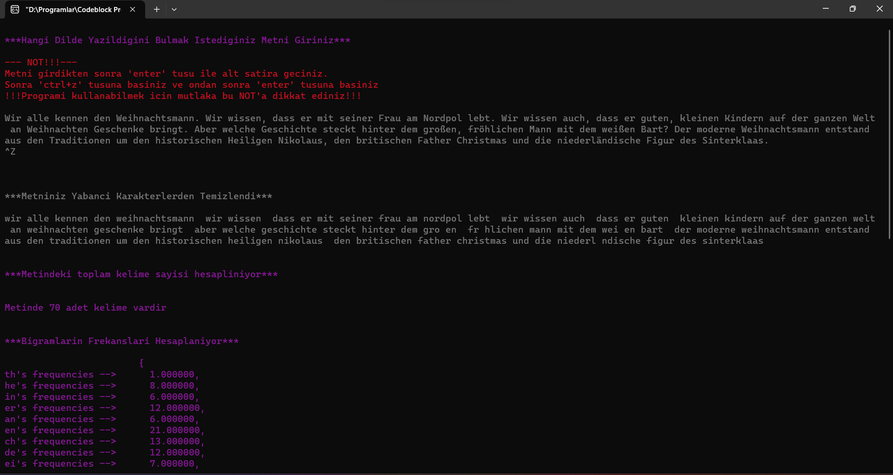

# Natural Language Processing Basic With C Language 

### Ahmet Bahadır Aksakal - İrem Atak

#### 20360859079

****

- [EN : Description :book: :leftwards_arrow_with_hook:](#en)  
- [TR : Açıklama :book: :leftwards_arrow_with_hook:](#tr)

****

#### [EN]

## Bursa Technical University - 1st Year Fall Semester - Algorithm and Programming Course Project Assignment

1. ### What the Program Does
    
     * This program finds the language in which the text entered by the user is written.

2. ### Technology and Languages Used in the Project:
    
     * **C**

3. ### How to Use
    
     * The program is run via the command system.
     * The relevant text is entered into the console.
     * After entering the text, press the 'enter' key.
     * Press 'ctrl+z' then press 'enter' again. The program will make the necessary calculations and return the result to you.

4. ### General Working Structure
    
     * A text not to exceed 10000 characters is entered by the user.
     * The entered text is cleared of foreign characters.
     * Calculate the number of times bigrams and trigrams occur in the text.
     * Calculation is made with the given frequency values and whether the language of the text is German or English is printed on the screen.

5. ### Detailed Working Structure and Function Descriptions
    
     * #### Step 1:
        
         We used the function called getchar() in the for loop to eliminate errors (copy-paste-error) that may occur as a result of using the void text\_get(char str\[\]) function gets(), which is used when getting the text. Thus, we solved the copy-paste problem. We tried different functions, but we got errors again. We decided that the best way was to use a for loop. In case of consecutive text entry, instead of building and running each time, we put all our functions in the main into an endless loop and put a continuation condition in this loop. As long as that condition is not met, new text can be entered. When the condition is met, new text cannot be entered. After the entire text is entered, go to the bottom line with enter, type the eof character and click enter again. So the program works.
        
     * #### Step 2:
        
         The entered text is replaced with a space character instead of foreign characters with the void filter\_str(char str\[\]) function. Thus, the text is cleared of foreign characters. After cleaning the text, we converted all characters to lowercase. Our aim was to avoid any problems when searching for bigrams and trigrams.
        
     * #### Step 3:
        
         We calculated how many times each bigram was repeated in the text with the void calculate\_frequencies\_bi(char str\[\]) function in the entered text. We encountered a problem like this. For example, the word “the” has both a “th” bigram and a “he” bigram. In the first function we wrote, after counting the first bigram, it did not count the second bigram. In other words, it was calculating the bigrams incompletely. We solved this problem with the function we wrote in the project and paid attention to minimum RAM usage. We placed the calculated frequencies into the calculated\_frequencies\[i\] array respectively.
        
     * #### Step 4:
        
         We calculated how many times each trigram was repeated in the text with the void calculate\_frequencies\_tri(char str\[\]) function in the entered text. We placed the calculated frequencies into the calculated\_frequencies\[i+10\] array, respectively, starting from the 10th element.
        
     * #### Step 5:
        
         We scored separately for English and German languages with the void calculate\_distances() function. The score calculated for English is assigned to the Distances\[0\] array. The distances\[1\] array is assigned the score calculated for German. In the project, we were asked to make Euclidean calculations, but this calculation gave incorrect results in short texts. There were serious problems, especially with texts not exceeding 3 lines. The accuracy rate was almost below 70%. We have developed a new method to solve this problem. Our method is as follows: We selected bigrams and trigrams with frequencies higher than 1. For English, we added up the number of occurrences and placed them in the distances\[0\] array. For German, we collected them in the same way and placed them in the distances\[1\] array.
        
     * #### Step 6:
        
         We compared the values of distances\[0\] and distances\[1\] in the void detect\_lang() function. If the value of the Distances array at index 0 is greater, the language of the text is printed as English, otherwise it is printed as German. We used an algorithm to increase the accuracy of the specified language. We added a counter. This counter counts bigrams and trigrams with a repetition frequency of less than 1. If the counter is 20, the entered text is too short and the result may not be accurate. We sent a warning message to indicate this to the user. We added a 2nd counter. This counter counts bigrams and trigrams with a frequency of less than 5 repetitions. If the second counter is 20, the entered text is probably a sentence. Even if it is text, it may be in a different language. To indicate this, we send a warning message to the user. Our project is open to development. When a longer text in a different language is entered, sayac1 and sayac2 will become dysfunctional.
        
     * #### Note 1:
        
         We were asked to calculate the frequencies of bigrams and trigrams. We planned to calculate the frequencies by dividing the number of repetitions of bigrams and trigrams by the total number of words. We used the void text\_word\_count\_finder(char str\[\]) function to find the total words in the text. The working logic of this function is as follows: It defines the char array between 2 spaces as a word and calculates the number of words in the text based on this. We realized that this method did not always give accurate results and changed our method. We have not used this function anywhere. We wanted the function to be included in our project because we thought it might be needed if the project was developed.
        
     * #### Note 2:
        
         void SetColor(int ForgC) instead of this function, System(“COLOR D”); We could change the color of the entire text using the function, but we could not make changes where we wanted. We wanted to find a function where we could change the color of the text in the parts we wanted. Since we did not have enough knowledge, we found this function by getting help from various forums. We added the function libraries and the function to our text and made the coloring operations we wanted. The reason we use this function is to attract the user's attention and add visual aesthetics. We think that the design of the project is as important as its function.
        
6. ### Images from the Program:
    
     *   
     *   
       

****
****

#### [TR]

## Bursa Teknik Üniversitesi - 1. Sınıf Güz Dönemi - Algoritma ve Programlama Dersi Proje Ödevi

1.  ### Program Ne Yapar
    
    *   Bu program kullanıcının girdiği metnin, hangi dilde yazıldığını bulmaktadır.

2.  ### Projede Kullanılan Teknoloji Ve Diller:
    
    * **C**

3.  ### Nasıl Kullanılır
    
    *   Program komut sistemi üzerinden çalıştırılır.
    *   İlgili metin konsola girilir.
    *   Metin girildikten sonra 'enter' tuşuna basınız.
    *   ctrl+z' tuşuna basınız sonra 'enter' tusuna tekrar basınız. Program gerekli hesaplamaları yapıp sonucu size döndürecektir.

4.  ### Genel Çalışma Yapısı
    
    *   10000 karakteri aşmayacak bir metin kullanıcı tarafından girilir.
    *   Girilen metin yabancı karakterlerden temizlenir.
    *   Bigram ve trigramlarin metinde kaç kez geçtiği hesaplanır.
    *   Verilen frekans değerleriyle hesaplama yapılır ve metnin dilinin Almanca mı yoksa İngilizce mi olduğu ekrana yazdırılır.

5.  ### Detaylı Çalışma Yapısı Ve Fonksiyon Açıklamları
    
    *   #### Adım 1:
        
        Metin alınırken kullanılan void metni\_al(char str\[\]) fonksiyonu gets() kullanımı sonucu oluşabilecek hataları (copy-paste-error) gidermek için getchar() isimli fonksiyonu for döngüsü içinde kullandık. Böylece copy- paste sorununu çözdük. Daha farklı fonksiyonları da denedik ama tekrardan hata aldık. En doğru yöntemin for döngüsünü kullanmak olduğuna karar verdik. Art arda metin girilmesi durumunda her seferinde build and run yapmak yerine maindeki bütün fonksiyonlarımızı sonsuz bir döngünün içine aldık ve bu döngüde bir devam koşulu koyduk . O koşul gerçekleşmediği sürece yeni metin girilebiliyor. Koşul gerçekleştiğindeyse yeni metin girilemiyor .Metnin tamamı girildikten sonra enter ile alt satıra geçip eof karakter tuşlanır ve tekrardan entera tıklanır . Böylece program çalışır.
        
    *   #### Adım 2:
        
        Girilen metin void filter\_str(char str\[\]) fonksiyonu ile yabancı karakterlerin yerine boşluk karakteri yerleştirilir. Böylece metin yabancı karakterlerden temizlenmiş olur. Metni temizledikten sonra bütün karakterleri küçük harfe dönüştürdük. Amacımız bigram ve trigramlar aranırken sorun çıkmamasıydı.
        
    *   #### Adım 3:
        
        Girilen metinde void calculate\_frequencies\_bi(char str\[\]) fonksiyonu ile her bir bigramın metinde kaç kez tekrar ettiğini hesapadık. Şöyle bir sorunla karşılaştık. Örneğin “the” kelimesinde hem “th” bigramı hem de “he” bigramı var. İlk yazdığımız fonksiyonda ilk bigramı saydıktan sonra ikinci bigramı saymıyordu. Yani bigramları eksik hesaplıyordu. Projede yazdığımız fonksiyonla bu sorunu çözdük ve minimum düzeyde RAM kullanımına dikkat ettik. Hesaplanan frekansaları calculated\_frequencies\[i\] dizisine sırasıyla yerleştirdik.
        
    *   #### Adım 4:
        
        Girilen metinde void calculate\_frequencies\_tri(char str\[\]) fonksiyonu ile her bir trigramın metinde kaç kez tekrar ettiğini hesapladık. Hesaplanan frekansaları 10. elemandan başlayacak şekilde calculated\_frequencies\[i+10\] dizisine sırasıyla yerleştirdik.
        
    *   #### Adım 5:
        
        void calculate\_distances() fonksiyonu ile İngilizce ve Almanca dilleri için ayrı ayrı puanlama yaptık . Distances\[0\] dizisine İngilizce için hesaplananpuan atanır. distances\[1\] dizisineyse Almanca için hesaplanan puan atanır. Projede bizden öklit hesaplaması yapmamız isteniyordu ama bu hesaplama kısa metinlerde hatalı sonuç veriyordu. Özellikle 3 satırı geçmeyen metinlerde ciddi sorunlar oluyordu. Doğruluk oranı nerdeyse %70’in altındaydı. Bu sorunu çözecek yeni bir yöntem geliştirdik. Yöntemimiz şu şekilde frekansı 1’den yüksek olan bigram ve trigramları seçtik. İngilizce için bunların tekrar sayısını toplayıp distances\[0\] dizisine yerleştirdik. Almanca içinse aynı şekilde toplayıp distances\[1\] dizisine yerleştirdik.
        
    *   #### Adım 6:
        
        void detect\_lang() fonksiyonunda distances\[0\] ve distances\[1\]’in değerlerini karşılaştırdık . Distances dizisinin 0. indeksteki değeri daha büyükse metnin dilinin İngilizce olduğu ekrana yazdırılıyor, değilse Almanca olduğu yazdırılıyor. Belirlenen dilin doğruluğunu arttırmak için bir algoritma kullandık. Bir sayaç ekledik. Bu sayaç tekrar sıklığı 1’den az olan bigram ve trigramları sayıyor. Eğer sayaç 20 ise girilen metin çok kısadır ve sonuç doğru olmayabilir. Bunu kullanıcıya da belirtmek için uyarı mesajı gönderdik. 2. bir sayaç ekledik. Bu sayaç bigram ve trigramların tekrar sıklığı 5’den az olanlarını sayıyor. 2. sayaç 20 ise girilen metin muhtemelen bir cümledir. Metinse de farklı bir dil olabilir. Bunu belirtmek için de kullanıcıya bir uyarı mesajı gönderiyoruz. Projemiz geliştirilmeye açık. Farklı dilde daha uzun bir metin girildiğinde sayac1 ve sayac2 işlevsiz kalacaktır.
        
    *   #### Not 1:
        
        Bizden bigram ve trigramların frekanslarının hesaplanması istendi. Frekansları ,bigram ve trigramların tekrar sayılarını toplam kelime sayısına bölüp hesaplamayı planladık. void metinde\_kelime\_sayisi\_bulucu(char str\[\]) fonksiyonunu metindeki toplam kelimeyi bulmak için kullandık. Bu fonksiyonun çalışma mantığı şöyledir: 2 boşluk arasındaki char dizisini kelime olarak tanımlar ve bundan yola çıkarak metindeki kelime sayısını hesaplar. Bu yöntemin her zaman doğru sonuç vermediğini fark ettik ve yöntemimizi değiştirdik. Bu fonksiyonu herhangi bir yerde kullanmadık. Fonksiyonun projemizde bulunmasını istedik çünkü proje geliştirilirse ihtiyaç duyulabileceğini düşündük.
        
    *   #### Not 2:
        
        void SetColor(int ForgC) bu fonksiyonun yerine ilk başta System(“COLOR D”); fonksiyonunu kullanarak bütün metnin rengini değiştirebiliyorduk ama istediğimiz yerlerde değişiklik yapamıyorduk. İstediğimiz kısımlarda metnin rengini değiştirebileceğimiz bir fonksiyon bulmak istedik . Yeterli bilgimiz olmadığından çeşitli forumlardan yardım alarak bu fonksiyonu bulduk. Fonksiyonun kütüphanelerini ve fonksiyonu metnimize ekleyerek istediğimiz renklendirme işlemlerini yaptık. Bu fonksiyonu kullanmamızın nedeni kullanıcının dikkatini çekmek ve görsel bir estetiklik katmaktır. Projenin işlevi kadar tasarımının da önemli olduğunu düşünüyoruz.
        
6.  ### Programdan Görseller:
    
    *   
    *   

 
